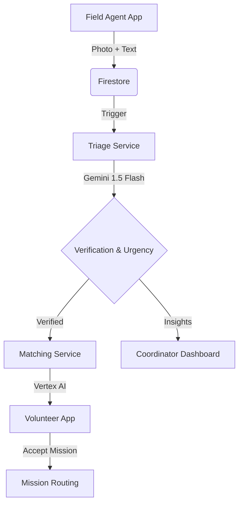

# 🛰️ ResourceRadar AI
### Real-time Humanitarian Resource Allocation via Multimodal AI

[](https://opensource.org/licenses/Apache-2.0)
[](https://nextjs.org)
[](https://flutter.dev)
[](https://deepmind.google/technologies/gemini/)

**ResourceRadar AI** is a state-of-the-art humanitarian platform designed to bridge the "last-mile" gap in disaster response. By combining multimodal AI triage with vector-based volunteer matching, it ensures that help reaches those who need it most, in seconds, not hours.

---

## 🚀 Key Features

- **🧠 Multimodal AI Triage**: Automated verification of help requests using **Google Gemini 1.5 Pro**. Analyzes text (English/Hindi/Hinglish) and photos to confirm legitimacy, calculate urgency (0-100), and categorize the incident type.
- **⚡ Intelligent Volunteer Matching**: AI-driven vector semantic matching that automatically routes the closest, best-equipped volunteers to specific crises based on skills and assets, instead of a traditional first-come-first-serve model.
- **📱 Dual-App Ecosystem (Mobile)**:
    - **Field Agent App**: Flutter-based, ultra-low-bandwidth reporting tool for trusted first responders with offline-first data capture support.
    - **Volunteer App**: Task-focused Flutter interface for responders with real-time mission routing and a global needs map.
- **🗺️ Coordinator Dashboard (Web)**: Real-time Next.js command center with live signal feeds, interactive maps, and AI analysis breakdowns for incident commanders.
- **🤖 Zero-Friction Chatbot Access**: Telegram and SMS integrations allowing victims to report emergencies instantly without downloading an app in low-bandwidth zones.
- **🕵️ Automated Duplicate Detection**: Gemini vision models cross-reference incoming photos to automatically cluster redundant reports and flag suspicious claims, preventing wasted resources.
- **📡 Real-time Event Backend**: Firebase Firestore synced with event-driven processors and location intelligence for automatic geocoding and map plotting of critical signals.

## 🏗️ Architecture



## 📂 Repository Structure

- `apps/field-agent/`: Flutter app for reporting needs.
- `apps/volunteer/`: Flutter app for responders.
- `apps/coordinator-nextjs/`: Next.js 14 management dashboard.
- `backend/triage-service/`: Python/Gemini service for signal analysis.
- `backend/matching-service/`: Python service for volunteer allocation.

## 🛠️ Quick Start

### 1. Prerequisites
- Flutter SDK (3.16+)
- Node.js (18+)
- Python (3.10+)
- Google Cloud Project with Gemini API & Maps SDK enabled.

### 2. Environment Setup
Copy `.env.example` to `.env` in the root directory and add your API keys:
```bash
GEMINI_API_KEY=your_key
NEXT_PUBLIC_GOOGLE_MAPS_API_KEY=your_key
GOOGLE_CLOUD_PROJECT=your_project_id
```

### 3. Run Locally
```bash
# Start Triage Service
cd backend/triage-service && pip install -r requirements.txt && python src/listener.py

# Start Coordinator Dashboard
cd apps/coordinator-nextjs && npm install && npm run dev
```

## ⚖️ License
Distributed under the **Apache License 2.0**. See `LICENSE` for more information.

---
Built with ❤️ for humanity by [ResourceRadar Team]
